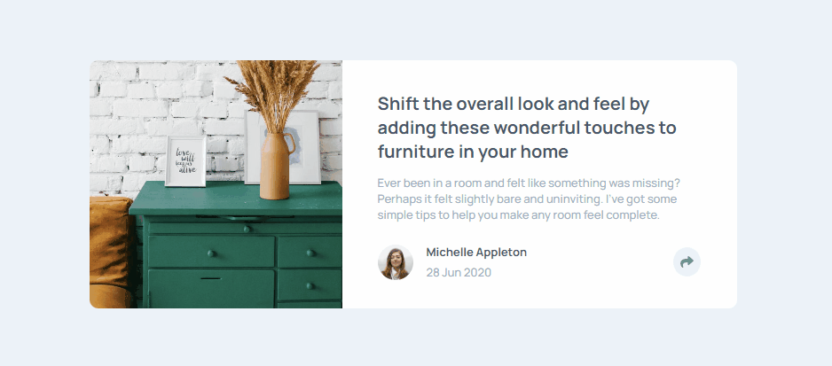
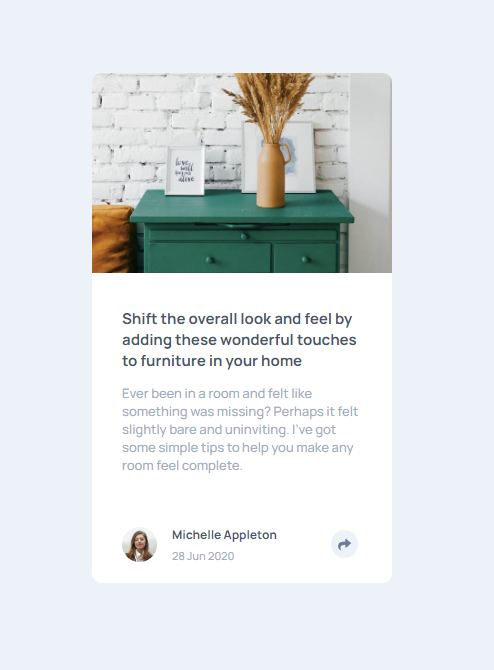

# Desafio do frontend mentor - Article preview component solution 

Esta é uma solução para o [Desafio article preview component do Frontend Mentor](https://www.frontendmentor.io/challenges/article-preview-component-dYBN_pYFT).

## Índice

- [Visão geral](#visão-geral)
  - [Desafio](#desafio)
  - [Screenshot](#screenshot)
  - [Links](#links)
- [Meu processo](#meu-processo)
  - [Tecnologias utilizadas](#tecnologias-utilizadas)
  - [Desenvolvimento](#desenvolvimento)
- [Autor](#autor)

## Visão geral

### Desafio

- criar o layout ideal para o projeto, dependendo do tamanho da tela do dispositivo.
- mostrar os links de compartilhamento de mídia social quando o ícone de compartilhamento for clicado

### Screenshot

#### Desktop

#### Mobile

### Links

- URL da página: [Article preview component](https://alexjr53.github.io/Article-preview-component/) 
- solução do projeto no frontend mentor: [Article preview component](https://www.frontendmentor.io/solutions/article-preview-component-NrkVi-Cl8J)

## Meu processo

### Tecnologias utilizadas

- HTML
- CSS
- Javascript

### Desenvolvimento

Atualmente estou usando desafios do frontend mentor apenas para praticar, aprimorando assim meus conhecimentos de HTML, CSS e JS, para que no futuro possa aprimorar este e outros projetos também feitos a partir do frontend mentor.

## Autor
Alexsandro rosa junior

- GitHub - [Alexjr53](https://github.com/Alexjr53)
